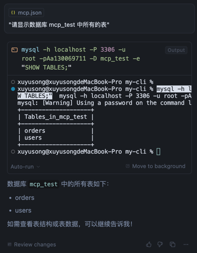

# ✨ mysql-mcp 
> 💫 Customize your own Mysql MCP for your application to CRUD

## 🔨 Test
1. 新建一个 .env 文件，配置自己的 mysql config
    ``` shell
    MYSQL_HOST=localhost
    MYSQL_PORT=3306
    MYSQL_USER=root
    MYSQL_PASSWORD=your_pwd
    MYSQL_DATABASE=mcp_test
    ```

2. 编译后，配置 mcp server，此处使用 cursor 示范
   ```shell
   # 编译
   go build -o mysql-mcp-server main.go
   ```
   配置 mcp server
   ```json
   {
     "mcpServers": {
       "mysql-database": {
         "command": "/path/to/mysql-mcp-server",
         "env": {
           "MYSQL_HOST": "localhost",
           "MYSQL_PORT": "3306",
           "MYSQL_USER": "root",
           "MYSQL_PASSWORD": "your_password",
           "MYSQL_DATABASE": "mcp_test"
         }
       }
     }
   }
   ```

3. 至此 cursor/... 可以访问配置的 mysql 数据：
   > 查询到了初次启动生成的 mock 数据

   